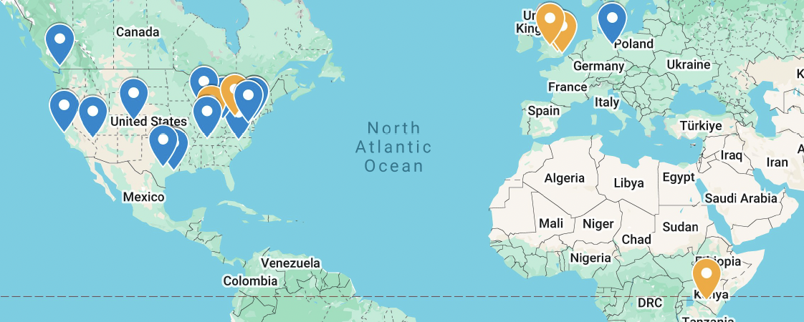

Here's a map of places I've given talks (blue markers represent in-person presentations, while yellow markers represent the primary audience for a virtual presentation):

## Invited Talks and Seminars
- **Blette, B.**. Exploring the Nature of Individualized Treatment Effects
  - *CMStatistics, London, UK / Virtual*, December 2024
- **Blette, B.**, Desai, M., Elkin, P., Lindsell, C. Generative AI as a Tool for Advancing Translational Science: Opportunities and Potential Pitfalls
  - *ACTS Translational Science, Las Vegas, NV*, April 2024
- **Blette, B.**, Kahan, B., Harhay, M., Li, F. Evaluating informative cluster size in cluster-randomized trials
  - *ENAR Spring Meeting, Baltimore, MD*, March 2024
- **Blette, B.**, Kahan, B., Halpern, S., Harhay, M., Li, F. Practical issues in cluster-randomized trials: Missing data and assessing assumptions
  - *University of Louisville Department of Biostatistics Seminar, Virtual*, February 2024
- **Blette, B.**, Kahan, B., Harhay, M., Li, F. Evaluating informative cluster size in cluster-randomized trials
  - *CMStatistics, Berlin, Germany*, December 2023
- **Blette, B.**, Moutchia, J., Al-Naamani, N., Ventetuolo, C., Cheng, C., Appleby, D., Urbanowicz, R., Fritz, J., Mazurek, J., Li, F., Kawut, S., Harhay, M. Is low-risk status a surrogate outcome in pulmonary arterial hypertension? An analysis of three randomised trials
  - *Pulmonary Vascular Research Institute Community Seminar, Virtual*, July 2023
- **Blette, B.**, Gilbert, P., Hudgens, M. Combining causal and joint modeling methods to address practical issues in HIV clinical trials
  - *University of Pennsylvania Division of Biostatistics Seminar, Philadelphia, PA*, February 2023
- **Blette, B.**, Gilbert, P., Hudgens, M. Combining causal and joint modeling methods to address practical issues in HIV clinical trials
  - *Ohio State University Division of Biomedical Informatics Seminar, Columbus, OH*, February 2023
- **Blette, B.**, Gilbert, P., Hudgens, M. Combining causal and joint modeling methods to address practical issues in HIV clinical trials
  - *Vanderbilt Department of Biostatistics Seminar, Nashville, TN*, January 2023
- **Blette, B.**, Gilbert, P., Hudgens, M. Combining Causal and Joint Modeling Methods to Address Policy-Relevant Questions using HIV Vaccine Trial Data
  - *RAND Statistics Group Seminar, Virtual*, January 2023
- **Blette, B.**, Gilbert, P., Hudgens, M. Combining causal and joint modeling methods to address practical issues in HIV clinical trials
  - *Northwestern University Division of Biostatistics Seminar, Chicago, IL*, January 2023
- **Blette, B.**, Gilbert, P., Hudgens, M. Causal joint modeling of longitudinal and survival data: An IPW approach
  - *International Biometric Society: Kenya Region Seminar Series, Virtual*, November 2022
- **Blette, B.** Association vs. causation in medical research
  - *Penn Palliative and Advanced Illness Research (PAIR) Center Seminar Series, Philadelphia, PA*, July 2022
- **Blette, B.**, Gilbert, P., Hudgens, M. Causal joint modeling of longitudinal and survival data: An IPW approach
  - *Center for Causal Inference (CCI) Seminar Series, Philadelphia, PA*, April 2022
    
## Contributed Talks
- **Blette, B.**, Kahan, B., Forbes, A., Harhay, M., Li, F. Evaluating informative cluster size in cluster-randomized trials.
  - *10th Annual Conference on Current Developments in Cluster Randomized Trials and Stepped Wedge Designs, Birmingham, UK / Virtual*, November 2024
- **Blette, B.**, Moutchia, J., Al-Naamani, N., Ventetuolo, C., Cheng, C., Appleby, D., Urbanowicz, R., Fritz, J., Mazurek, J., Li, F., Kawut, S., Harhay, M. Multivariable risk scores as potential surrogate outcomes in pulmonary arterial hypertension trials
  - *American Thoracic Society International Conference, Washington DC*, May 2023
- **Blette, B.**, Halpern, S., Li, F., Harhay, M. Assessing treatment effect heterogeneity in the presence of missing effect modifier data in cluster-randomized trials
  - *ENAR Spring Meeting, Nashville, TN*, March 2023
- **Blette, B.**, Halpern, S., Li, F., Harhay, M. Assessing treatment effect heterogeneity in the presence of missing effect modifier data in cluster-randomized trials
  - *8th Annual Conference on Current Developments in Cluster Randomized Trials and Stepped Wedge Designs, London, UK / Virtual*, November 2022
- **Blette, B.**, Gilbert, P., Hudgens, M. Addressing confounding and continuous exposure measurement error using conditional score functions
  - *Joint Statistical Meetings, Washington DC*, August 2022 (Biometrics Section Paper Award presentation)
- **Blette, B.**, Hudgens, M. Causal joint modeling of longitudinal and survival data using the parametric g-formula
  - *ENAR Spring Meeting, Houston, TX*, March 2022
- **Blette, B.**, Gilbert, P., Hudgens, M. Addressing concurrent confounding and measurement error using conditional score functions
  - *ENAR Spring Meeting, Virtual*, March 2021
- **Blette, B.**, Gilbert, P., Hudgens, M. Structural joint modeling of longitudinal and survival data
  - *ENAR Spring Meeting, Virtual*, March 2020
- **Blette, B.** Preparing for the next Zika epidemic: Clinical, epidemiological, and statistical Challenges
  - *UNC Prospective Students Day, Chapel Hill, NC*, February 2020
- **Blette, B.**, Gilbert, P., Hudgens, M. Structural joint modeling of longitudinal and survival Data
  - *UNC Student Seminar, Chapel Hill, NC*, September 2019
- **Blette, B.**, Gilbert, P., Shepherd, B., Hudgens, M. Post-randomization biomarker effect modification in an HIV vaccine clinical trial
  - *ENAR Spring Meeting, Philadelphia, PA*, March 2019
- **Blette, B.**, Richardson, A., Jiao, Y. Modeling considerations in data-driven attribution
  - *Google Internship Presentation, Mountain View, CA*. September, 2018
- **Blette, B.**, Ploutz-Snyder, R., Feiveson, A. Data analysis challenges in the space life sciences
  - *Space Life Sciences Summer Institute Research Conference, Houston, TX*, August 2015

## Posters
- **Blette, B.**, Kahan. B, Harhay, M., Li. F. Assessing informative cluster size in cluster-randomized trials
  - *American Causal Inference Conference, Austin, TX*, May 2023
- **Blette, B.**, Halpern, S., Li, F., Harhay, M. Assessing treatment effect heterogeneity in the presence of missing effect modifier data in cluster-randomized trials
  - *Penn DBEI and CCEB Research Day, Philadelphia, PA*, March 2022
- **Blette, B.**, Howard, A.G., Frerichs, L. Latent class analysis for classification of latent policy environments: A case study
  - *Joint Statistical Meetings, Denver, CO*, August 2019
